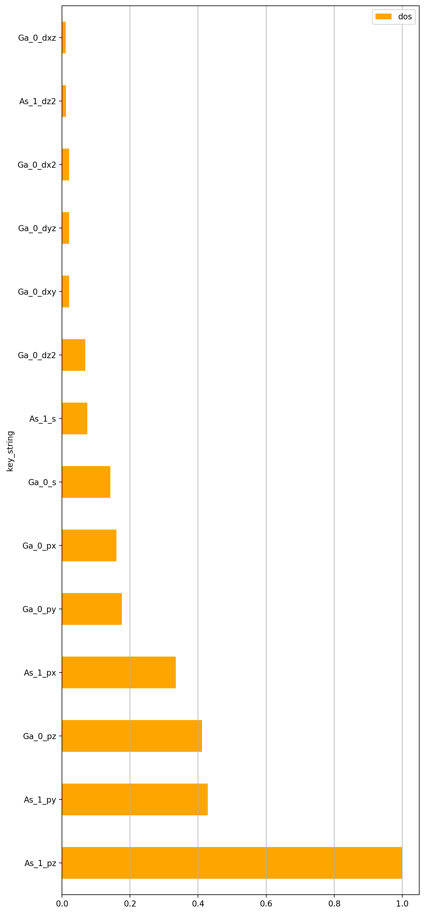
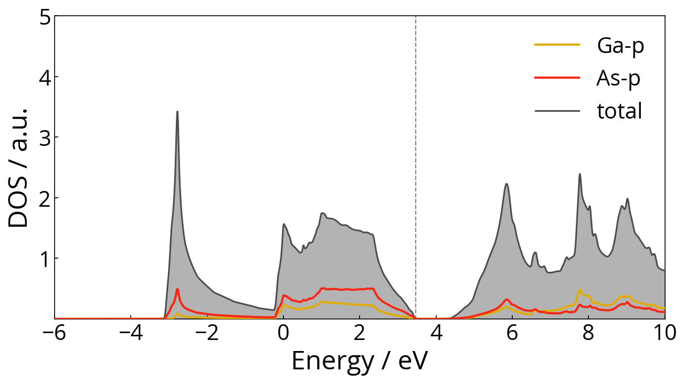

# Wannier90_Toolbox

Useful tools integrated for VASP/Wannier90 interface:

1. Give suggestions about key inputs for Wannier90 including `projection` and `dis_windows`.

2. Easy-accessible help function for Wannier90 input.

3. Evaluate Wannier90 interpolation result.

4. low requirement for running. Requirement: `pymatgen` andother common python packages `numpy`, `matplotlib` and `scipy`.

## 1. Pre-Wannier90 Tool

`pre_w90_tool.py` offers different outputs with arguments input including DOS (density of states) analysis and suggestions for Wannier90 input.

```
usage: pre_w90_tool.py [-h] [--path PATH] [--no-soc] [--pick PICK]
                       [-e ERANGE ERANGE] [--plot] [--extra EXTRA]
                       mode

Pre analysis before Wannier90 Interpolation.

positional arguments:
  mode              Mode: dos, kpath, band, template

optional arguments:
  -h, --help        show this help message and exit
  --path PATH       Default: .
  --no-soc          with SOC or not. Default: False
  --pick PICK       Minimum of selected orbital / max single orbital. default:
                    0.1
  -e ERANGE ERANGE  Energy range.
  --plot            plot the dos distribution
  --extra EXTRA     Extra input.
```

The `dos` mode is the essential utility in `pre_w90_tool.py`. The program will give the suggestion of projection including total DOS (density of states) and projected DOS within a given energy range with input `-e` arguments.

First, `per_w90_tool.py` will give the dos distribution of each orbital at each atom. 

$$
\text{DOS} = \int_{E_1}^{E_2} \text{dos}_{atom, orb}(E)\,\mathrm{dE}
$$

⚠ Since the default value of `EMIN` and `the EMAX` in VASP is lowest and highest KS-eigenvalue, please mind that there might be some problems for integral calculation outside the `EMIN` and `EMAX` interval. 

In `GaAs` example, `python pre_w90_tool.py dos -e 2 5 --plot --no-soc --pick 0.15` gives

```
Calculated DOS Energy Range: 2.0, 5.0
   species structure_id orb_id orb_name key_string       dos
0       Ga            0      0        s     Ga_0_s  0.023871
1       Ga            0      1       py    Ga_0_py  0.195084
2       Ga            0      2       pz    Ga_0_pz  0.282813
...
```

⚠ Notice that `dos` column is normalized with maximum of 1 and the energy doesn't subtract the Fermi level. If we add argument `--plot`, `pre_w90_tool.py` will generate a histogram with `key_string` and `dos`. In order to not make the figure too long, there is a threshold for histogram plotting that the dos distribution is at least 0.01.



Based on the dos distribution and `--pick pick_rate` input, we choose the DOS distribution larger than `pick_rate` as the projection input for Wannier90. Related output as following

```
Number of Selected Orbitals: 6

Number of Selected WFs: 6

Selected Orbitals: 
  species site  orb
0      Ga   -1  [p]
1      As   -1  [p]

Wannier90 Projection:
Ga:l=1
As:l=1
```

⚠ Notice that the number of selected orbitals is not always equal to the number of WFs (Wannier function). When the system includes SOC, there are twice of the number orbitals needed for WFs. This is controlled by the argument `--no-soc`. It becomes important when we input the argument `--extra`  for `dis_windows` suggestion.

Make full use of the above message, we can decide the projections for Wannier90 input. These projections can also be parsed to `pre_w90_tool.py` by following

```
python pre_w90_tool.py dos -e -6 14 --plot --no-soc --extra 'Ga,0,1-3;As,1,1-3'Calculated DOS Energy Range: -6.0, 14.0
There are 10 states in [-6.0, 14.0] with Fermi level at 3.467.
Suggest dis_froz_min & dis_froz_max as following:
nwann: 6    degenercy: 1    Fermi:     3.467000

WANRING: There are states between given `emin`: -6.0 and lowest `dis_froz_min`: 3.470754. Please carefully treat the suggestion of dis_froz_min / dis_froz_max and check energy range of each bands again. This situation usually happens in no-SOC system with many denegeracy point. But we still want to give you some useful energy window information with states less than number of WFs.

   dis_froz_min  dis_froz_max      pdos       tdos   percent
4     -6.000000      5.220833  1.172082   2.663917  0.439984
0      3.470754     10.658390  2.108112   6.807999  0.309652
3      7.464829     14.206528  3.352538  10.885037  0.307995
2      3.470755     12.387263  3.097869  10.639155  0.291176
1      3.470755     12.060134  3.153824  11.116874  0.283697
5     -6.000000      7.175487  2.794993   9.946576  0.281000

Lowest `dis_win_max` for -6.0: 13.100133999999999
```

⚠ If you input the energy range for integral calculation outside the `EMIN` and `EMAX` interval, you might get unreasonable result of `pdos` and `tdos`.

First, the `--extra` argument is separated by `;` and each part consists of `species, structure_id, orbital_id`. The setting of `structure_id` and `orbital_id` is the same as [`pymatgen`](https://pymatgen.org/pymatgen.electronic_structure.core.html#pymatgen.electronic_structure.core.Orbital) starting from `0`. These indices of orbitals are basically the order in
which the orbitals are reported in VASP and have no special meaning. You can use `-` to replace the continuous number. For example, you can use `0-3` to replace `0,1,2,3` both in `structure_id` and `orbital_id` input.

The `pdos` column gives the summation of all the atom and orbital input. The `tdos` column gives the total DOS. The `percent` column gives the quotient of both.

⚠ For system without SOC,  there are many degeneracy points affecting our dis energy suggest procedure.  

⚠ The percentage of `pdos` versus `tdos` doesn't directly mean the quality of fitting.

Since `dis_windows` require an energy window containing states larger than the number of target WFs. We also give the lowest bound for `dis_win_max` if you make the lower input energy become`dis_win_min`.

The selected projection can also be plotted by adding the argument `--plot`. Remind of your input energy range.


⚠ Notice that if the input energy is too small to containing enough states, the suggestion will become empty.

```
$ python pre_w90_tool.py dos -e 2 5 --plot --no-soc --extra 'Ga,0,1-3;As,1,1-3'

Calculated DOS Energy Range: 2.0, 5.0
There are 4 states in [2.0, 5.0] with Fermi level at 3.467.
Empty DataFrame
Columns: [dis_froz_min, dis_froz_max, pdos, tdos, percent]
Index: []
Plot with selected orbitals in `brown` and not selected orbitals in `orange`.
6 orbitals selected
Plot 14 orbitals with 6 selected
```

`pre_w90_tool.py` also gives some other useful messages for Wannier90 input.

- In `kpath` mode, `pre_w90_tool.py` converts VASP-type `{path}/KPOINTS` into `Wannier90` input .

- In `band` mode, `pre_w90_tool.py` generates `bnd.dat` file with k-distance and energy eigenvalue in p4vasp-format in `{path}` folder. For spinful system, `pre_w90_tool.py` will export band data to `bnd_up.dat` and `bnd_down.dat` separately.

- In `template` mode, `pre_w90_tool.py` offers templates for `wannier90.win`. Within `extra` input (`basic`, `wann`, `band`), we can choose one of the detailed parts to print.

## 2. EIGENVAL Analysis

Since we have some `dis_windows` suggestions from `pre_w90_tool.py`, you might need`dis_win_suggest.py` to offer a more detailed eigenvalue analysis. The eigenvalue file can be `EIGENVAL` and `wannier90.eig`.

```
usage: dis_win_suggest.py [-h] [-i EIG] [--path PATH] [--efermi EFERMI]
                          [-w NWANN] [-n NBNDS_EXCL] [-d NDEG]
                          [-e ERANGE ERANGE] [--seperate]
                          mode

CLI Tool for W90 energy windows.

positional arguments:
  mode              Mode: report, plot, count, suggest

optional arguments:
  -h, --help        show this help message and exit
  -i EIG            Select wannier90.eig file or EIGENVAL file. Default:
                    EIGENVAL
  --path PATH       Default: .
  --efermi EFERMI   Fermi level. Default value is generated from
                    `vasprun.xml`.
  -w NWANN          Number of Wannier Functions. Default: 0
  -n NBNDS_EXCL     Number of bands excluded
  -d NDEG           Number of degeneracy.
  -e ERANGE ERANGE  Energy range.
  --separate        Calculate bands not separately.
```

The `report` mode prints a table about the distribution of eigenvalues. 

```
python dis_win_suggest.py report 
```

```
EFERMI:  3.467000
--------------------------------
Band No.     EMIN        EMAX
--------------------------------
  0~  2   -11.34863   -11.21636
  3~  4   -11.20861   -11.17761
  5~  5    -8.90720    -6.59268
  6~  8    -3.10932    +3.46676
  9~ 35    +3.61018   +41.52101
--------------------------------
```

So we can clear see the Fermi level is located at `3.467` and there is a gap between `-6.59268` and `-3.10932`. It's also the reason why we use `-e -6 15` in previous section for `dis_windows` suggestion.

Detailed distribution of each band can be achieved by argument `--separate`. We can also use `-e` to control the band energy to show.

```
python dis_win_suggest.py report --separate -e -6 15 -d 1
```

```
EFERMI:  3.467000
--------------------------------
Band No.     EMIN        EMAX
--------------------------------
    6      -3.10932    +3.46675
    7      -0.24141    +3.46676
    8      +0.51331    +3.46676
    9      +3.61018    +7.46083
   10      +5.22483    +9.11682
   11      +7.17949   +13.09613
   12      +7.17949   +13.09614
   13     +10.66239   +13.96102
   14     +12.06413   +16.37072
   15     +12.39126   +17.32905
   16     +14.21053   +18.69125
   17     +14.89751   +19.88154
   18     +14.89751   +21.08752
--------------------------------
```

The result can output to `eigenval_dis.png` by switching `report` mode to `plot` mode.


The `count` mode gives how many states inside the given energy window.

```
$ python dis_win_suggest.py count -e -6 15

There are 13 states in [-6.0, 15.0].
```

The `suggest` mode gives the `dis_windows` suggestion the same as `pre_w90_tool.py` requiring you manually input the number of WFs through argument `-w` but without `tdos` and `pdos`. Since this report only requires `EIGENVAL` or `wannier90.eig`, so it's much faster than `pre_w90_tool.py` especially your `vasprun.xml` is quiet large.

```
$ python dis_win_suggest.py suggest -e -6 15 -d 1 -w 6

Lowest `dis_win_max` for -6.0: 13.100133999999999
`dis_froz_min` and `dis_froz_max` Table:
There are 13 states in [-6.0, 15.0] with Fermi level at 3.467.
Suggest dis_froz_min & dis_froz_max as following:
nwann: 6    degenercy: 1    Fermi:     3.467000

WANRING: There are states between given `emin`: -6.0 and lowest `dis_froz_min`: 3.470754. Please carefully treat the suggestion of dis_froz_min / dis_froz_max and check energy range of each bands again. This situation usually happens in no-SOC system with many denegeracy point. But we still want to give you some useful energy window information with states less than number of WFs.

   dis_froz_min  dis_froz_max
0      3.470754     10.658390
1      3.470755     12.060134
2      3.470755     12.387263
3      7.464829     14.206528
4      9.120819     14.893510
5      9.120819     14.893510
6     13.100137     17.779136
7     -6.000000      5.220833
8     -6.000000      7.175487
```

## 3. Comparison of VASP and Wannier90 results

After Wannier90 have wannierised and interpolated band structure, `cmp_vasp_w90.py` can compare the first-principle DFT results from VASP with Wannier90 band data.

```
usage: cmp_vasp_w90.py [-h] [--efermi EFERMI] [--path PATH] [--vasp VASP] [--ylim YLIM YLIM]
                       [--kernel KERNEL] [--show-fonts] [--fontfamily FONTFAMILY]
                       [--fontsize FONTSIZE] [--no-spread] [--no-quality] [--quiet]
                       name

Comparsion between VASP band and Wannier90 band. `bnd.dat` for VASP band data in p4vasp format
and `wannier90_band.dat`, `wannier90_band.labelinfo.dat`, and `wannier90.wout` are required for
plotting and analysis.

positional arguments:
  name                  name of system

optional arguments:
  -h, --help            show this help message and exit
  --efermi EFERMI       Fermi level. Default value is generated from `vasprun.xml`.
  --path PATH           Default: .
  --vasp VASP           location of VASP band file in p4vasp format
  --ylim YLIM YLIM      Energy bound for plot. Default: [E_w90.min - 1, E_w90.max + 1]
  --kernel KERNEL       kernel function for evaluating diff: type, middle, width. There are two
                        type of kernel function: unit and gaussian. Defalut=unit,2,5
  --show-fonts          Show all availabel font families can be used in `rcParams`
  --fontfamily FONTFAMILY
                        Set font family manually. Default: Open Sans
  --fontsize FONTSIZE   Set font size manually. Default: 18
  --no-spread           Don't plot spreading
  --no-quality          Don't show quality of fitting
  --quiet               Equal to --no-spreading --no-quality
```

Since the VASP and Wannier90 apply different kpoints in band calculation, we need to use B-spline to interpolate the Wannier90 band data and compare with VASP band data. The quality of Wannier90 result is evaulated from

$$
\Delta_i= \max_{\mathbf{k}}\left|\varepsilon_{i, \mathbf{k}}^{\mathrm{DFT}}-\varepsilon_{i, \mathbf{k}}^{\mathrm{TB}}\right|{\color{red} f\left(\varepsilon_{i, \mathbf{k}}^{\mathrm{DFT}}\right)}
$$

for each band. $$f(\cdot)$$ is the kernel function (unit function or gaussian function). $$i$$ and $$\bf k$$ represent band index and kpoint separately.

Example usage:

```
$ python cmp_vasp_w90.py GaAs2 --kernel unit,3.5,1 --ylim -1 1

INFO:cmp:Reading Data from ./bnd.dat
INFO:cmp:k label: ['G', 'X', 'W', 'K', 'G', 'L', 'U', 'W', 'L', 'K', 'U', 'X']
INFO:cmp:Energy range: [-1.0, 1.0]
INFO:cmp:Output figure: ./GaAs2_VASP_W90_cmp.png
INFO:cmp:Evaluating Band Quality:
INFO:cmp:nbnds_excl: 6
INFO:cmp:=== MAX DIFF of VASP vs W90 with each bands (meV) ===


    1 ++----------------+-----------------+-----------------+-----------------+----------------++
      +                 +                 +                 +                 +                 +
      |                                                                                         |
      |                                                                                         |
      |                                                                                         |
      |                                                                                         |
  0.5 ++                                                                                       ++
      |                                                                                         |
      |                                                                                         |
      |                                                                                         |
      |                                                                                         |
      |                                                                                         |
    0 *******************************************************************************************
      |                                                                                         |
      |                                                                                         |
      |                                                                                         |
      |                                                                                         |
      |                                                                                         |
      |                                                                                         |
 -0.5 ++                                                                                       ++
      |                                                                                         |
      |                                                                                         |
      |                                                                                         |
      |                                                                                         |
      +                 +                 +                 +                 +                 +
   -1 ++----------------+-----------------+-----------------+-----------------+----------------++
      1                 2                 3                 4                 5                 6

Gnuplot warns: Warning: empty y range [0:0], adjusting to [-1:1]
cmp_vasp_w90.py:160: RuntimeWarning: invalid value encountered in double_scalars
  logger.info(f'Average dE (meV): {np.sum(dEs) / np.sum(wgts)}')
INFO:cmp:Average dE (meV): nan
INFO:cmp:Show spreading convergence:


     +-----*--------+--------------+---------------+--------------+--------------+--------------+
     +     *        +              +               +              +              +              +
     |     *                                                                                    |
     |     *                                                                                    |
     |     *                                                                                    |
  30 ++    *                                                                                   ++
     |     *                                                                                    |
     |     *                                                                                    |
     |     *                                                                                    |
     |     *                                                                                    |
  25 ++    *                                                                                   ++
     |      *                                                                                   |
     |      *                                                                                   |
     |      *                                                                                   |
     |       *                                                                                  |
     |       *                                                                                  |
  20 ++      *                                                                                 ++
     |       *                                                                                  |
     |        *                                                                                 |
     |        ***********************************************************************           |
     |                                                                                          |
     |                                                                                          |
  15 ++                                                                                        ++
     |                                                                                          |
     +              +              +               +              +              +              +
     +--------------+--------------+---------------+--------------+--------------+--------------+
     0              5              10              15             20             25             30

INFO:cmp:MIN_NUM_ITER: 26   SPREAD: 17.0317092107
```


### GaAs Example

We use GaAs as example. See input file at `./GaAs` folder. DOS is plotted below.



After self-consitant calculation of VASP, 

1. `python pre_w90_tool.py template` to get how to write `wannier90.win`. 

2. `python pre_w90_tool.py kpath` to get `Kpoint_Path` for Wannier90.

3. `python pre_w90_tool.py band --path ../bnd` to generate p4vasp-type `bnd.dat` file. For simplicity, I recommend you copy or link this file to `wannier` folder.

4. **Do DOS analysis**. This is the key feature for `Wannier90_Toolbox` and above description has been very detaild.

5. Compare your Wannier90 interpolation result with VASP through `python cmp_vasp_w90.py GaAs2 --kernel unit,3.5,1 --ylim -1 1` . ⚠ Remind that the parameters for kernel function is middle point and its half width. You can also check maximum difference between VASP and Wannier90 for each bands and the total spreading convergence during the wannierisation.

## TODO

See `grep TODO *.py`
