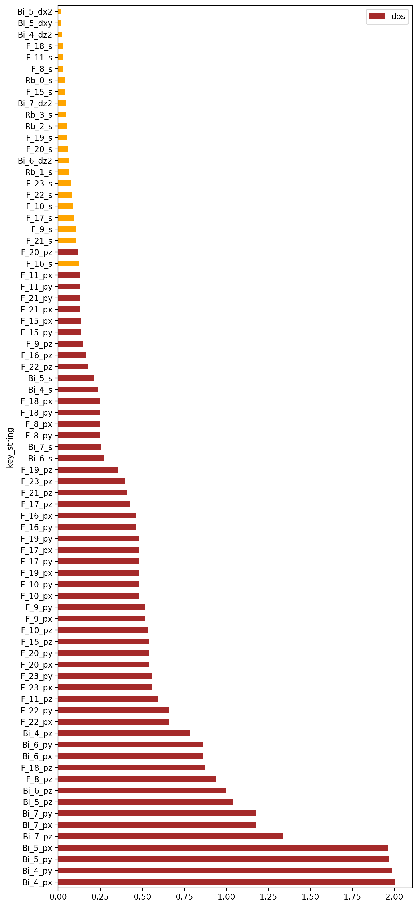

# Wannier90_Toolbox

Useful tools integrated for VASP/Wannier90 interface

### 1. Pre Wannier90 工具 `pre_w90_tool.py`

`pre_w90_tool.py` 功能和使用方式

```
usage: pre_w90_tool.py [-h] [--path PATH] [--no-soc] [--pick PICK]
                       [-e ERANGE ERANGE] [--plot] [--extra EXTRA]
                       mode

Pre analysis before Wannier90 Interpolation. dos: python pre_w90_tool.py dos
--plot -e -4 7 --extra 'Bi,4-7,0-3;F,8-23,1-3'

positional arguments:
  mode              Mode: kpath, band, template, dos

optional arguments:
  -h, --help        show this help message and exit
  --path PATH       Default: .
  --no-soc          with SOC or not. Default: False
  --pick PICK       Minimum of selected orbital / max single orbital. default:
                    0.1
  -e ERANGE ERANGE  Energy range.
  --plot            plot the dos distribution
  --extra EXTRA     Extra input.
```



```
Reading vasprun.xml file from `./vasprun.xml` for dos analysis

Calculated DOS Energy Range: -4.0, 7.0
   species structure_id orb_id orb_name key_string       dos
0       Rb            0      0        s     Rb_0_s  0.037680
1       Rb            0      1       py    Rb_0_py  0.012406
2       Rb            0      2       pz    Rb_0_pz  0.011214
3       Rb            0      3       px    Rb_0_px  0.012405
4       Rb            0      4      dxy   Rb_0_dxy  0.003787
5       Rb            0      5      dyz   Rb_0_dyz  0.003915
6       Rb            0      6      dz2   Rb_0_dz2  0.005617
7       Rb            0      7      dxz   Rb_0_dxz  0.003784
8       Rb            0      8      dx2   Rb_0_dx2  0.003657
9       Rb            1      0        s     Rb_1_s  0.065030
10      Rb            1      1       py    Rb_1_py  0.005342
11      Rb            1      2       pz    Rb_1_pz  0.005213
12      Rb            1      3       px    Rb_1_px  0.005343
13      Rb            1      4      dxy   Rb_1_dxy  0.001042
14      Rb            1      5      dyz   Rb_1_dyz  0.000782
15      Rb            1      6      dz2   Rb_1_dz2  0.002346
16      Rb            1      7      dxz   Rb_1_dxz  0.000651
17      Rb            1      8      dx2   Rb_1_dx2  0.001042
18      Rb            2      0        s     Rb_2_s  0.054866
19      Rb            2      1       py    Rb_2_py  0.005343
20      Rb            2      2       pz    Rb_2_pz  0.008862
21      Rb            2      3       px    Rb_2_px  0.005343
22      Rb            2      4      dxy   Rb_2_dxy  0.001173
23      Rb            2      5      dyz   Rb_2_dyz  0.000912
24      Rb            2      6      dz2   Rb_2_dz2  0.001564
25      Rb            2      7      dxz   Rb_2_dxz  0.000912
26      Rb            2      8      dx2   Rb_2_dx2  0.001173
27      Rb            3      0        s     Rb_3_s  0.048115
28      Rb            3      1       py    Rb_3_py  0.009283
29      Rb            3      2       pz    Rb_3_pz  0.008093

Number of Selected Orbitals: 45

Number of Selected WFs: 90

Selected Orbitals: 
   species site       orb
0        F    8       [p]
1        F    9  [py, px]
2        F   10       [p]
3        F   11      [pz]
4        F   15      [pz]
5        F   16  [py, px]
6        F   17       [p]
7        F   18       [p]
8        F   19       [p]
9        F   20  [py, px]
10       F   21      [pz]
11       F   22  [py, px]
12       F   23       [p]
13      Bi   -1    [s, p]
Plot with selected orbitals in brown and not selected orbitals in orange.
64 orbitals selected
Plot 77 orbitals with 55 selected

Wannier90 Projection:
c=0.796077,0.796077,0.388318:l=1
c=0.483654,0.483654,0.450903:py;px
c=0.160467,0.160467,0.481326:l=1
c=0.845610,0.845610,0.536804:pz
c=0.647194,0.647194,0.941660:pz
c=0.342466,0.342466,0.027646:py;px
c=0.999237,0.999237,0.997965:l=1
c=0.696831,0.696831,0.090252:l=1
c=0.393290,0.393290,0.179315:l=1
c=0.050074,0.050074,0.149652:py;px
c=0.746405,0.746405,0.239254:pz
c=0.442817,0.442817,0.328464:py;px
c=0.099691,0.099691,0.299079:l=1
Bi:l=0;l=1
```

### 2. 能量窗口推荐以及必要输入生成 `dis_win_suggest.py`

`dis_win_suggest.py` 功能和使用方式

```
usage: dis_win_suggest.py [-h] [-i EIG] [--path PATH] [--efermi EFERMI]
                          [-w NWANN] [-n NBNDS_EXCL] [-d NDEG]
                          [-e ERANGE ERANGE] [--seperate]
                          mode

CLI Tool for W90 energy windows.

positional arguments:
  mode              Mode: report, plot, count, support

optional arguments:
  -h, --help        show this help message and exit
  -i EIG            Select wannier90.eig file or EIGENVAL file. Default:
                    EIGENVAL
  --path PATH       Default: .
  --efermi EFERMI   Fermi level. Default value is generated from
                    `vasprun.xml`.
  -w NWANN          Number of Wannier Functions. Default: 0
  -n NBNDS_EXCL     Number of bands excluded
  -d NDEG           Number of degeneracy
  -e ERANGE ERANGE  Energy range.
  --separate        Calculate bands not separately.
```

### 3. VASP 和 Wannier90 能带比较 `cmp_vasp_w90.py`

`cmp_vasp_w90.py` 功能和使用方式

```
usage: cmp_vasp_w90.py [-h] [--efermi EFERMI] [--path PATH] [--vasp VASP] [--ylim YLIM YLIM]
                       [--kernel KERNEL] [--show-fonts] [--fontfamily FONTFAMILY]
                       [--fontsize FONTSIZE] [--no-spread] [--no-quality] [--quiet]
                       name

Comparsion between VASP band and Wannier90 band. `bnd.dat` for VASP band data in p4vasp format
and `wannier90_band.dat`, `wannier90_band.labelinfo.dat`, and `wannier90.wout` are required for
plotting and analysis.

positional arguments:
  name                  name of system

optional arguments:
  -h, --help            show this help message and exit
  --efermi EFERMI       Fermi level. Default value is generated from `vasprun.xml`.
  --path PATH           Default: .
  --vasp VASP           location of VASP band file in p4vasp format
  --ylim YLIM YLIM      Energy bound for plot. Default: [E_w90.min - 1, E_w90.max + 1]
  --kernel KERNEL       kernel function for evaluating diff: type, middle, width. There are two
                        type of kernel function: unit and gaussian. Defalut=unit,2,5
  --show-fonts          Show all availabel font families can be used in `rcParams`
  --fontfamily FONTFAMILY
                        Set font family manually. Default: Open Sans
  --fontsize FONTSIZE   Set font size manually. Default: 18
  --no-spread           Don't plot spreading
  --no-quality          Don't show quality of fitting
  --quiet               Equal to --no-spreading --no-quality
```

列出所有可以直接传入 `rcParams` 的字体名

```python
from matplotlib import font_manager as fm
fpaths = fm.findSystemFonts()
family_name = set([fm.get_font(i).family_name for i in fpaths])
print(sorted(family_name))
```

> [python - How to get a list of all the fonts currently available for Matplotlib? - Stack Overflow](https://stackoverflow.com/questions/8753835/how-to-get-a-list-of-all-the-fonts-currently-available-for-matplotlib)

```
INFO:cmp:Reading Data from ./bnd.dat
INFO:cmp:k label: ['Y', 'X1', 'N', 'G', 'Y', 'F', 'L', 'I', 'F1', 'Z', 'I1', 'M', 'G', 'X']
INFO:cmp:Energy range: (-6.36847203, 9.601045169999999)
INFO:cmp:Output figure: ./trinew4_VASP_W90_cmp.png
INFO:cmp:Evaluating Band Quality:
INFO:cmp:nbnds_excl: 72
INFO:cmp:=== DIFF of VASP vs W90 with each bands (meV) ===


  140 ++-----------+------------+------------+-----------+------------+-*----------+-----------++
      +            +            +            +           +            * **         +            +
      |                                                               ****                      |
      |                                                               **  *                     |
  120 ++                                                             **   *                    ++
      |                                                              **   *     **              |
      |                                                              **   *     **              |
  100 ++                                                            *     *     **             ++
      |                                                             *     *    * *              |
      |                                                             *      * * * *              |
      |                                                             *      * *** *              |
   80 ++                                                            *      * *   *             ++
      |                                                             *      * *   *              |
      |                                                             *      * *   *              |
   60 ++                                                            *      * *   *             ++
      |                                                             *       **   *              |
      |                                                             *       **   *              |
      |                                                             *       **   *              |
   40 ++                                            *               *       **   *             ++
      |                                             *               *       **   *              |
      |                                             *               *       **    *             |
   20 ++                   *                       * *            ***        *    *            ++
      |                    **           *          * *  *         *          *    *             |
      |                   ** *     **  ***   **   ** *** ***     *                 *            |
      +            +      *  **** ******  **** ****      * *******    +            *            +
    0 +*******************------+**----------*-----------+------------+------------******------++
      0            20           40           60          80          100          120          140

INFO:cmp:Average dE (meV): 30.148142230465407
INFO:cmp:Show spreading convergence:


       +--------------+--------------+--------------+-------------+--------------+--------------+
       +              +              +              +             +              +              +
  1800 ++                                                                                      ++
       |                                                                                        |
       |                                                                                        |
       |                                                                                        |
  1600 ++                                                                                      ++
       |                                                                                        |
       |                                                                                        |
       |                                                                                        |
  1400 ++                                                                                      ++
       ***                                                                                      |
       |  *                                                                                     |
       |   *                                                                                    |
  1200 ++  *                                                                                   ++
       |    *                                                                                   |
       |    *                                                                                   |
       |     *                                                                                  |
  1000 ++    ***                                                                               ++
       |        *********************************************************************           |
       |                                                                                        |
       |                                                                                        |
   800 ++                                                                                      ++
       |                                                                                        |
       +              +              +              +             +              +              +
       +--------------+--------------+--------------+-------------+--------------+--------------+
       0              5              10             15            20             25             30

INFO:cmp:MIN_NUM_ITER: 26   SPREAD: 945.8446716649
```
